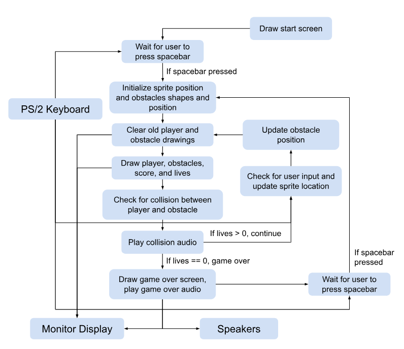

# Final Report

### Game Description

User controls a sprite in third person perspective using a PS/2 keyboard to dodge the obstacles. There will be multiple lanes with obstacles spawning randomly. The score will be displayed on the screen. The sprite will "run" faster as time goes on, so it will be harder to dodge obstacles. The user gets 3 lives and when the sprite hits an obstacle, a collision sound will be played. After 3 collisions, it will be game over. An audio clip will be played, the final score and game over screen will be displayed.

<br>

### Updated Black Diagram
<br>

<br>

### How to play the game

1. Needs the PS/2 keyboard, a monitor for display, and speaker for audio
2. To start, press the space bar
3. Start with 3 lives, dodge the obstacles for as long as you can using the arrow keys to move up, down, left, or right
4. To restart the game (from the game over screen), press the space bar

<br>

### Attribution Table

| Task                                                         | Mainly Assigned to  | Modification     |
| ------------------------------------------------------------ | ------------------- | ---------------- |
| Main Game Logic including<br />1. Generation of obstacles at random position & obstacles movement<br />2. Player movement<br />3. Collision<br />4. Score system | Haozhe              | Haozhe & Wilbert           |
| VGA things including<br />1. Visualization of **background**<br />2. Visualization of **player character** (including animation) and **obstacles**<br />3. Clear elements without clearing the whole screen<br />4. **Start Page** and **Game Over Page** display | Haozhe              | Haozhe           |
| HP system + soap system<br />(Note: soap system was removed in final project due to unfixable bug) | Haozhe & Wilbert    | Haozhe & Wilbert |
| Visualization of **Score** and **HP**                        | Wilbert             | Wilbert          |
| Sound effect including<br />1. Colliding obstacles<br />2. Game Over sound<br />3. Colliding soap sound (Removed in the final project) | Wilbert             | Wilbert & Haozhe |
| PS/2 Keyboard (Polling)                                      | Wilbert             | Wilbert          |
| Debugging and Bug fixing                                     | Together in the lab | Together         |

<br>

### Code

Here's our `main.c` code excluding image and sound data:

```c++
#include <stdlib.h>
#include <stdbool.h>
#include <time.h>
#include <stdint.h>

#define HEX3_HEX0 ((volatile uint32_t *) 0xFF200020)
#define HEX5_HEX4 ((volatile uint32_t *) 0xFF200030)

#define OBSTACLE_1_X_POS 53 // 106 / 2 = 53
#define OBSTACLE_2_X_POS 160// 106 + 108 / 2 = 106 + 54 = 160
#define OBSTACLE_3_X_POS 267 // 320 - 53 = 267
#define HALF_OBSTACLE_1_WIDTH 53
#define HALF_OBSTACLE_2_WIDTH 54
#define HALF_OBSTACLE_3_WIDTH 53
#define HALF_OBSTACLES_HEIGHT 40

#define PLAYER_SPEED 30
#define SCREEN_HEIGHT 240
#define SCREEN_WIDTH 320
#define PLAYER_X_OFFSET 10
#define PLAYER_Y_OFFSET 12 // should be 12.5 but make it easier for player
#define LANES 3

const int hex_codes[16] = {
    0b00111111, // 0
    0b00000110, // 1
    0b01011011, // 2
    0b01001111, // 3
    0b01100110, // 4
    0b01101101, // 5
    0b01111101, // 6
    0b00000111, // 7
    0b01111111, // 8
    0b01100111, // 9
    0b01110111, // A
    0b01111100, // b
    0b00111001, // C
    0b01011110, // d
    0b01111001, // E
    0b01110001  // F
};

const short unsigned int scores_display[10][20] = {
    {0xFFFF, 0xFFFF, 0xFFFF, 0xFFFF, 0xFFFF, 0x0, 0x0, 0xFFFF, 0xFFFF, 0x0, 0x0, 0xFFFF, 0xFFFF, 0x0, 0x0, 0xFFFF, 0xFFFF, 0xFFFF, 0xFFFF, 0xFFFF},
    {0x0, 0x0, 0x0, 0xFFFF, 0x0, 0x0, 0x0, 0xFFFF, 0x0, 0x0, 0x0, 0xFFFF, 0x0, 0x0, 0x0, 0xFFFF, 0x0, 0x0, 0x0, 0xFFFF},
    {0xFFFF, 0xFFFF, 0xFFFF, 0xFFFF, 0x0, 0x0, 0x0, 0xFFFF, 0xFFFF, 0xFFFF, 0xFFFF, 0xFFFF, 0xFFFF, 0x0, 0x0, 0x0, 0xFFFF, 0xFFFF, 0xFFFF, 0xFFFF},
    {0xFFFF, 0xFFFF, 0xFFFF, 0xFFFF, 0x0, 0x0, 0x0, 0xFFFF, 0xFFFF, 0xFFFF, 0xFFFF, 0xFFFF, 0x0, 0x0, 0x0, 0xFFFF, 0xFFFF, 0xFFFF, 0xFFFF, 0xFFFF},
    {0xFFFF, 0x0, 0x0, 0xFFFF, 0xFFFF, 0x0, 0x0, 0xFFFF, 0xFFFF, 0xFFFF, 0xFFFF, 0xFFFF, 0x0, 0x0, 0x0, 0xFFFF, 0x0, 0x0, 0x0, 0xFFFF},
    {0xFFFF, 0xFFFF, 0xFFFF, 0xFFFF, 0xFFFF, 0x0, 0x0, 0x0, 0xFFFF, 0xFFFF, 0xFFFF, 0xFFFF, 0x0, 0x0, 0x0, 0xFFFF, 0xFFFF, 0xFFFF, 0xFFFF, 0xFFFF},
    {0xFFFF, 0xFFFF, 0xFFFF, 0xFFFF, 0xFFFF, 0x0, 0x0, 0x0, 0xFFFF, 0xFFFF, 0xFFFF, 0xFFFF, 0xFFFF, 0x0, 0x0, 0xFFFF, 0xFFFF, 0xFFFF, 0xFFFF, 0xFFFF},
    {0xFFFF, 0xFFFF, 0xFFFF, 0xFFFF, 0x0, 0x0, 0x0, 0xFFFF, 0x0, 0x0, 0x0, 0xFFFF, 0x0, 0x0, 0x0, 0xFFFF, 0x0, 0x0, 0x0, 0xFFFF},
    {0xFFFF, 0xFFFF, 0xFFFF, 0xFFFF, 0xFFFF, 0x0, 0x0, 0xFFFF, 0xFFFF, 0xFFFF, 0xFFFF, 0xFFFF, 0xFFFF, 0x0, 0x0, 0xFFFF, 0xFFFF, 0xFFFF, 0xFFFF, 0xFFFF},
    {0xFFFF, 0xFFFF, 0xFFFF, 0xFFFF, 0xFFFF, 0x0, 0x0, 0xFFFF, 0xFFFF, 0xFFFF, 0xFFFF, 0xFFFF, 0x0, 0x0, 0x0, 0xFFFF, 0x0, 0x0, 0x0, 0xFFFF}
};

const short unsigned int score_text_display[5][20] = {
    {0xFFFF, 0xFFFF, 0xFFFF, 0xFFFF, 0xFFFF, 0x0, 0x0, 0x0, 0xFFFF, 0xFFFF, 0xFFFF, 0xFFFF, 0x0, 0x0, 0x0, 0xFFFF, 0xFFFF, 0xFFFF, 0xFFFF, 0xFFFF},
    {0xFFFF, 0xFFFF, 0xFFFF, 0xFFFF, 0xFFFF, 0x0, 0x0, 0x0, 0xFFFF, 0x0, 0x0, 0x0, 0xFFFF, 0x0, 0x0, 0x0, 0xFFFF, 0xFFFF, 0xFFFF, 0xFFFF},
    {0xFFFF, 0xFFFF, 0xFFFF, 0xFFFF, 0xFFFF, 0x0, 0x0, 0xFFFF, 0xFFFF, 0x0, 0x0, 0xFFFF, 0xFFFF, 0x0, 0x0, 0xFFFF, 0xFFFF, 0xFFFF, 0xFFFF, 0xFFFF},
    {0xFFFF, 0xFFFF, 0xFFFF, 0xFFFF, 0xFFFF, 0x0, 0x0, 0xFFFF, 0xFFFF, 0xFFFF, 0xFFFF, 0x0, 0xFFFF, 0x0, 0x0, 0xFFFF, 0xFFFF, 0x0, 0x0, 0xFFFF},
    {0xFFFF, 0xFFFF, 0xFFFF, 0xFFFF, 0xFFFF, 0x0, 0x0, 0x0, 0xFFFF, 0xFFFF, 0xFFFF, 0xFFFF, 0xFFFF, 0x0, 0x0, 0x0, 0xFFFF, 0xFFFF, 0xFFFF, 0xFFFF}
};

struct audio_t {
    volatile unsigned int control;
    volatile unsigned char rarc;
    volatile unsigned char ralc;
    volatile unsigned char wsrc;
    volatile unsigned char wslc;
    volatile unsigned int ldata;
    volatile unsigned int rdata;
};

volatile int pixel_buffer_start;
short int Buffer1[240][512]; // 240 rows, 512 (320 + padding) columns
short int Buffer2[240][512];

int player_pos_x;
int player_pos_y = 220;
int old_player_pos_x, old_player_pos_y;
int obstacle_height[5];
int obstacle_height_old[5];
bool obstacle_pos[5][3] = {0};
bool obstacle_pos_old[5][3] = {0};
int current_speed;
int arrow_input = 0;
char byte1 = 0, byte2 = 0;
int mark;
bool keyboard_start = false;
bool keyboard_reset = false;
int player_HP = 3;
struct audio_t *const audiop = ((struct audio_t *) 0xff203040);

void swap(int *a, int *b);
void plot_pixel(int x, int y, short int line_color);
void draw_ranctangle(int x, int y, int half_witdh, int half_height, short int line_color);
void clear_screen();
void wait_for_vsync();
void get_button_input();
void get_keyboard_input_poll();
void play_game_over_audio();
void play_collide_obstacle_audio();
bool game(); // if return true, means game over, if return false, it means game ended accidentally
bool collideObstacle(int x, int y, int half_width, int half_height);
void showGameOver();
void display_hex_digit(int display_num, int value, int blank);
void display_number_on_hex(int number);
void draw_score_text();
void draw_score(int mark);
void draw_score_digit(int position, int score);
void draw_hp(int hp);
void draw_hp_digit(int position, int hp);

int main(void)
{
    arrow_input = 0;
	srand(time(NULL));
    volatile int * pixel_ctrl_ptr = (int *)0xFF203020;
    // declare other variables(not shown)
    // initialize location and direction of rectangles(not shown)

    /* set front pixel buffer to Buffer 1 */
    *(pixel_ctrl_ptr + 1) = (int) &Buffer1; // first store the address in the  back buffer
    /* now, swap the front/back buffers, to set the front buffer location */
    wait_for_vsync();
    /* initialize a pointer to the pixel buffer, used by drawing functions */
    pixel_buffer_start = *pixel_ctrl_ptr;
    clear_screen(); // pixel_buffer_start points to the pixel buffer

    /* set back pixel buffer to Buffer 2 */
    *(pixel_ctrl_ptr + 1) = (int) &Buffer2;
    pixel_buffer_start = *(pixel_ctrl_ptr + 1); // we draw on the back buffer
    clear_screen(); // pixel_buffer_start points to the pixel buffer

    // =======Show Start Page========
    plot_image_start_page(0, 0);
    wait_for_vsync();
    while (1) {
        get_keyboard_input_poll();        
        if (keyboard_start) {
            keyboard_reset = false;
            keyboard_start = false;

            /* set front pixel buffer to Buffer 1 */
            *(pixel_ctrl_ptr + 1) = (int) &Buffer1; // first store the address in the  back buffer
            /* now, swap the front/back buffers, to set the front buffer location */
            wait_for_vsync();
            /* initialize a pointer to the pixel buffer, used by drawing functions */
            pixel_buffer_start = *pixel_ctrl_ptr;
            clear_screen(); // pixel_buffer_start points to the pixel buffer

            /* set back pixel buffer to Buffer 2 */
            *(pixel_ctrl_ptr + 1) = (int) &Buffer2;
            pixel_buffer_start = *(pixel_ctrl_ptr + 1); // we draw on the back buffer
            clear_screen(); // pixel_buffer_start points to the pixel buffer
            break;
        }
    }
    // ====End of Show Start Page====
    
    // game start
    while (1) {
        if (game()) {
            showGameOver();
            play_game_over_audio();
            draw_score(mark);
            draw_score_text();
            while (1) {
                get_keyboard_input_poll();
                if (keyboard_reset) {
                    keyboard_reset = false;
                    keyboard_start = false;

                    /* set front pixel buffer to Buffer 1 */
                    *(pixel_ctrl_ptr + 1) = (int) &Buffer1; // first store the address in the  back buffer
                    /* now, swap the front/back buffers, to set the front buffer location */
                    wait_for_vsync();
                    /* initialize a pointer to the pixel buffer, used by drawing functions */
                    pixel_buffer_start = *pixel_ctrl_ptr;
                    clear_screen(); // pixel_buffer_start points to the pixel buffer

                    /* set back pixel buffer to Buffer 2 */
                    *(pixel_ctrl_ptr + 1) = (int) &Buffer2;
                    pixel_buffer_start = *(pixel_ctrl_ptr + 1); // we draw on the back buffer
                    clear_screen(); // pixel_buffer_start points to the pixel buffer
                    break;
                }
            }
        }
    }
}

void plot_pixel(int x, int y, short int line_color)
{
    if (x > SCREEN_WIDTH || x < 0 || y > SCREEN_HEIGHT || y < 0)
        return;
    volatile short int *one_pixel_address;
    one_pixel_address = pixel_buffer_start + (y << 10) + (x << 1);
    *one_pixel_address = line_color;
}

void swap(int *a, int *b) {
    int temp = *a;
    *a = *b;
    *b = temp;
}

void draw_ranctangle(int x, int y, int half_witdh, int half_height, short int line_color) {
    for (int i = ((x - half_witdh >= 0) ? (x - half_witdh) : 0); i < ((x + half_witdh) <= SCREEN_WIDTH ? (x + half_witdh) : SCREEN_WIDTH); ++i) {
        for (int j = ((y - half_height) >= 0 ? (y - half_height) : 0); j < ((y + half_height) <= SCREEN_HEIGHT ? (y + half_height) : SCREEN_HEIGHT); ++j) {
            plot_pixel(i, j, background[j * 320 + i]);
        }
    }
}

void wait_for_vsync() {
    volatile int * pixel_ctrl_ptr = (int *)0xFF203020;
    * pixel_ctrl_ptr = 1;
    while(*(pixel_ctrl_ptr + 3) & 0b1);
}

void clear_screen() {
    for (int i = 0; i < SCREEN_WIDTH; ++i) {
        for (int j = 0; j < SCREEN_HEIGHT; ++j) {
            plot_pixel(i, j, background[j * 320 + i]);
        }
    }
}

void get_button_input() {
    volatile int* buttons_ptr = (int *)0xFF200050;
    int button_data = *(buttons_ptr);
    
    if (button_data & 0b0001) { // key 0
        arrow_input = 1;
    } else if (button_data & 0b0010) { // key 1 pressed
        arrow_input = 2;
    }
}

void get_keyboard_input_poll() {
    volatile int * keyboard_ptr = (int * )0xFF200100;
    int keyboard_data = *(keyboard_ptr); // read the Data register in the PS/2 port
    int RVALID = keyboard_data & 0x8000; // extract the RVALID field
    
    if (RVALID) {
        /* shift the next data byte into the display */
        byte1 = byte2;
        byte2 = keyboard_data & 0xFF;
    
        if ((byte1 == (char)0xE0) && (byte2 == (char)0x74)) { // right arrow key press
            arrow_input = 1;
        } else if ((byte1 == (char)0xE0) && (byte2 == (char)0x6B)) { // left arrow key press
            arrow_input = 2;
        } else if ((byte1 == (char)0xE0) && (byte2 == (char)0x75)) { // up arrow key press
            arrow_input = 3;
        } else if ((byte1 == (char)0xE0) && (byte2 == (char)0x72)) { // down arrow key press
            arrow_input = 4;
        } else if ((byte1 == (char)0xF0) && (byte2 == (char)0x29)) { // space bar release
            keyboard_reset = true;
            keyboard_start = true;
        }
    }
}

void play_game_over_audio() {
    audiop->control = 0x8;
    audiop->control = 0x0;

    for (int i = 0; i < game_over_audio_samples_num; i++) {
        while (audiop->wsrc == 0);

        audiop->ldata = game_over_audio[i];
        audiop->rdata = game_over_audio[i];
    }
}

void play_collide_obstacle_audio() {
    audiop->control = 0x8;
    audiop->control = 0x0;

    for (int i = 0; i < collide_obstacle_audio_samples_num; i++) {
        while (audiop->wsrc == 0);

        audiop->ldata = collide_obstacle_audio[i];
        audiop->rdata = collide_obstacle_audio[i];
    }
}

void draw_hp(int hp) {
    if (hp < 0 || hp > 999) return;

    int hundreds = hp / 100;
    int tens = (hp / 10) % 10;
    int ones = hp % 10;

    draw_hp_digit(2, hundreds);
    draw_hp_digit(1, tens);
    draw_hp_digit(0, ones);
}

void draw_hp_digit(int position, int hp) { // need to move to the top left instead of top right
    int idx = 0;

    if (position == 0) { // ones digit
        for (int rowIdx = 0; rowIdx < SCREEN_HEIGHT; rowIdx++) {
            for (int colIdx = 0; colIdx < SCREEN_WIDTH; colIdx++) {
                if (rowIdx > 9 && rowIdx < 15 && colIdx > 25 && colIdx < 30 && idx < 20) {
                    plot_pixel(colIdx, rowIdx, scores_display[hp][idx]);
                    idx++;
                }
            }
        }
    } else if (position == 1) { // tens digit
        for (int rowIdx = 0; rowIdx < SCREEN_HEIGHT; rowIdx++) {
            for (int colIdx = 0; colIdx < SCREEN_WIDTH; colIdx++) {
                if (rowIdx > 9 && rowIdx < 15 && colIdx > 17 && colIdx < 22 && idx < 20) {
                    plot_pixel(colIdx, rowIdx, scores_display[hp][idx]);
                    idx++;
                }
            }
        }
    } else { // hundreds digit
        for (int rowIdx = 0; rowIdx < SCREEN_HEIGHT; rowIdx++) {
            for (int colIdx = 0; colIdx < SCREEN_WIDTH; colIdx++) {
                if (rowIdx > 9 && rowIdx < 15 && colIdx > 9 && colIdx < 14 && idx < 20) {
                    plot_pixel(colIdx, rowIdx, scores_display[hp][idx]);
                    idx++;
                }
            }
        }
    }
}

void draw_score_text() {
    int idx1 = 0, idx2 = 0, idx3 = 0, idx4 = 0, idx5 = 0;

    for (int rowIdx = 0; rowIdx < SCREEN_HEIGHT; rowIdx++) {
        for (int colIdx = 0; colIdx < SCREEN_WIDTH; colIdx++) {
            if (rowIdx > 9 && rowIdx < 15 && colIdx > 304 && colIdx < 309 && idx1 < 20) {
                plot_pixel(colIdx, rowIdx, score_text_display[4][idx1]);
                idx1++;
            }
            if (rowIdx > 9 && rowIdx < 15 && colIdx > 296 && colIdx < 301 && idx2 < 20) {
                plot_pixel(colIdx, rowIdx, score_text_display[3][idx2]);
                idx2++;
            }
            if (rowIdx > 9 && rowIdx < 15 && colIdx > 288 && colIdx < 293 && idx3 < 20) {
                plot_pixel(colIdx, rowIdx, score_text_display[2][idx3]);
                idx3++;
            }
            if (rowIdx > 9 && rowIdx < 15 && colIdx > 280 && colIdx < 285 && idx4 < 20) {
                plot_pixel(colIdx, rowIdx, score_text_display[1][idx4]);
                idx4++;
            }
            if (rowIdx > 9 && rowIdx < 15 && colIdx > 272 && colIdx < 277 && idx5 < 20) {
                plot_pixel(colIdx, rowIdx, score_text_display[0][idx5]);
                idx5++;
            }
        }
    }
}

void draw_score(int mark) {
    if (mark < 0 || mark > 999) return;

    int hundreds = mark / 100;
    int tens = (mark / 10) % 10;
    int ones = mark % 10;

    draw_score_digit(2, hundreds);
    draw_score_digit(1, tens);
    draw_score_digit(0, ones);
}

void draw_score_digit(int position, int score) {
    int idx = 0;

    if (position == 0) { // ones digit
        for (int rowIdx = 0; rowIdx < SCREEN_HEIGHT; rowIdx++) {
            for (int colIdx = 0; colIdx < SCREEN_WIDTH; colIdx++) {
                if (rowIdx > 17 && rowIdx < 23 && colIdx > 304 && colIdx < 309 && idx < 20) {
                    plot_pixel(colIdx, rowIdx, scores_display[score][idx]);
                    idx++;
                }
            }
        }
    } else if (position == 1) { // tens digit
        for (int rowIdx = 0; rowIdx < SCREEN_HEIGHT; rowIdx++) {
            for (int colIdx = 0; colIdx < SCREEN_WIDTH; colIdx++) {
                if (rowIdx > 17 && rowIdx < 23 && colIdx > 296 && colIdx < 301 && idx < 20) {
                    plot_pixel(colIdx, rowIdx, scores_display[score][idx]);
                    idx++;
                }
            }
        }
    } else { // hundreds digit
        for (int rowIdx = 0; rowIdx < SCREEN_HEIGHT; rowIdx++) {
            for (int colIdx = 0; colIdx < SCREEN_WIDTH; colIdx++) {
                if (rowIdx > 17 && rowIdx < 23 && colIdx > 288 && colIdx < 293 && idx < 20) {
                    plot_pixel(colIdx, rowIdx, scores_display[score][idx]);
                    idx++;
                }
            }
        }
    }
}

bool game() {
    // reset
    for (int i = 0; i < 5; ++i) {
        for (int j = 0; j < 3; ++j) {
            obstacle_pos[i][j] = false;
            obstacle_pos_old[i][j] = false;
        }
    }

    for (int i = 0; i < 5; ++i) {
        obstacle_height[i] = 0;
        obstacle_height_old[i] = 0;
    }
    volatile int * pixel_ctrl_ptr = (int *)0xFF203020;
    // draw player for the first time
    player_pos_x = SCREEN_WIDTH / 2;
	player_pos_y = 200;
    
    current_speed = 5;
    mark = 0;
	player_HP = 3;
    display_number_on_hex(player_HP);
	unsigned int time_counter = 0;

    plot_image_player_image_2(player_pos_x - PLAYER_X_OFFSET, player_pos_y - PLAYER_Y_OFFSET);
    old_player_pos_x = player_pos_x;
    old_player_pos_y = player_pos_y;
	

    // draw the obstacles for the first time
    for (int i = 0; i < 5; ++i) {
        obstacle_height[i] = -SCREEN_HEIGHT - (200 * i);
        int numObstacles = rand() % LANES;
        int placed = 0;
        while (placed < numObstacles) {
            int lane = rand() % LANES;
            if (obstacle_pos[i][lane] == 0) {
                obstacle_pos[i][lane] = 1;
                ++placed;
            }
        }
    }
	
    wait_for_vsync();
    pixel_buffer_start = *(pixel_ctrl_ptr + 1);

    // define player animation parameters
    bool current_is_player_image_1 = true;
    int player_animation_frame_counter = 0;
    
    for (;;) {
        if (time_counter >= 110) {
            current_speed += 1;
            time_counter = 0;
            ++mark;
            
        }
        ++time_counter;
		display_number_on_hex(player_HP);
		if (player_HP < 1)
			return true;
        // ===================Clear Screen====================
        draw_ranctangle(old_player_pos_x, old_player_pos_y, PLAYER_X_OFFSET + PLAYER_SPEED, PLAYER_Y_OFFSET + PLAYER_SPEED, 0);
        
        // clear old obstacles
        for (int i = 0; i < 5; ++i) {
            if (obstacle_pos_old[i][0] == true) {
                draw_ranctangle(OBSTACLE_1_X_POS, obstacle_height_old[i], HALF_OBSTACLE_1_WIDTH + current_speed, HALF_OBSTACLES_HEIGHT + current_speed, 0);
            }
            if (obstacle_pos_old[i][1] == true) {
                draw_ranctangle(OBSTACLE_2_X_POS, obstacle_height_old[i], HALF_OBSTACLE_2_WIDTH + current_speed, HALF_OBSTACLES_HEIGHT + current_speed, 0);
            }
            if (obstacle_pos_old[i][2] == true) {
                draw_ranctangle(OBSTACLE_3_X_POS, obstacle_height_old[i], HALF_OBSTACLE_3_WIDTH + current_speed, HALF_OBSTACLES_HEIGHT + current_speed, 0);
            }
        }
        // ================End of Clear Screen================

        // clear_screen();

        // ================Draw New Elements==================
        // draw new player
        if (player_animation_frame_counter > 2) {
            player_animation_frame_counter = 0;
            current_is_player_image_1 = !current_is_player_image_1;
        }
        ++player_animation_frame_counter;

        if (current_is_player_image_1) {
            plot_image_player_image_1(player_pos_x - PLAYER_X_OFFSET, player_pos_y - PLAYER_Y_OFFSET);
        }
        else {
            plot_image_player_image_2(player_pos_x - PLAYER_X_OFFSET, player_pos_y - PLAYER_Y_OFFSET);
        }


        // draw the new obstacles
        for (int i = 0; i < 5; ++i) {
            if (obstacle_pos[i][0] == true) {
                plot_image_poop_106_80(0, obstacle_height[i] - HALF_OBSTACLES_HEIGHT);
            }
            if (obstacle_pos[i][1] == true) {
                plot_image_poop_108_80(OBSTACLE_2_X_POS - HALF_OBSTACLE_2_WIDTH, obstacle_height[i] - HALF_OBSTACLES_HEIGHT);
            }
            if (obstacle_pos[i][2] == true) {
                plot_image_poop_106_80(OBSTACLE_3_X_POS - HALF_OBSTACLE_3_WIDTH, obstacle_height[i] - HALF_OBSTACLES_HEIGHT);
            }

        }
        // Wait for vertical sync to swap buffers
        // =============End of Draw New Elements==============
        
        draw_score(mark);
        draw_score_text();
        draw_hp(player_HP);

        wait_for_vsync();
        pixel_buffer_start = *(pixel_ctrl_ptr + 1);


        // ==========Update the Previous Position===========
        old_player_pos_x = player_pos_x;
        old_player_pos_y = player_pos_y;
        for (int i = 0; i < 5; ++i) {
            obstacle_height_old[i] = obstacle_height[i];
            for (int j = 0; j < 3; ++j) {
                obstacle_pos_old[i][j] = obstacle_pos[i][j];
            }
        }
        // ======End of Update the Previous Position=======

        // ================Check Game Over=================
        for (int i = 0; i < 5; ++i) {
            if (obstacle_pos[i][0] == true) {
                if (collideObstacle(OBSTACLE_1_X_POS, obstacle_height[i], HALF_OBSTACLE_1_WIDTH, HALF_OBSTACLES_HEIGHT)) {
                    --player_HP;
                    play_collide_obstacle_audio();
					obstacle_pos[i][0] = false;
					draw_ranctangle(OBSTACLE_1_X_POS, obstacle_height_old[i], HALF_OBSTACLE_1_WIDTH + current_speed + 10, HALF_OBSTACLES_HEIGHT + current_speed + 10, 0);
                    clear_screen();
                    wait_for_vsync();
                    pixel_buffer_start = *(pixel_ctrl_ptr + 1);
                }
			}
			
            if (obstacle_pos[i][1] == true) {
                if (collideObstacle(OBSTACLE_2_X_POS, obstacle_height[i], HALF_OBSTACLE_2_WIDTH, HALF_OBSTACLES_HEIGHT)) {
                    --player_HP;
                    play_collide_obstacle_audio();
					obstacle_pos[i][1] = false;
					draw_ranctangle(OBSTACLE_2_X_POS, obstacle_height_old[i], HALF_OBSTACLE_2_WIDTH + current_speed + 10, HALF_OBSTACLES_HEIGHT + current_speed + 10, 0);
                    clear_screen();
                    wait_for_vsync();
                    pixel_buffer_start = *(pixel_ctrl_ptr + 1);
                }
			}
			
            if (obstacle_pos[i][2] == true) {
                if (collideObstacle(OBSTACLE_3_X_POS, obstacle_height[i], HALF_OBSTACLE_3_WIDTH, HALF_OBSTACLES_HEIGHT)) {
                    --player_HP;
                    play_collide_obstacle_audio();
					obstacle_pos[i][2] = false;
					draw_ranctangle(OBSTACLE_3_X_POS, obstacle_height_old[i], HALF_OBSTACLE_3_WIDTH + current_speed + 10, HALF_OBSTACLES_HEIGHT + current_speed + 10, 0);
                    clear_screen();
                    wait_for_vsync();
                    pixel_buffer_start = *(pixel_ctrl_ptr + 1);
                }
			}
        }

        // ===========Update Elements Position=============
        // update player position
        get_keyboard_input_poll();
        switch (arrow_input)
        {
        case 1:
            player_pos_x += PLAYER_SPEED;
			if (player_pos_x >= SCREEN_WIDTH - PLAYER_X_OFFSET)
				player_pos_x = SCREEN_WIDTH - PLAYER_X_OFFSET - 1;
            arrow_input = 0;
            break;
        case 2:
            player_pos_x -= PLAYER_SPEED;
			if (player_pos_x <= PLAYER_X_OFFSET)
				player_pos_x = PLAYER_X_OFFSET + 1;
            arrow_input = 0;
            break;
        case 3:
            player_pos_y -= PLAYER_SPEED;
			if (player_pos_y <= PLAYER_Y_OFFSET)
				player_pos_y = PLAYER_Y_OFFSET + 1;
            arrow_input = 0;
            break;
        case 4:
            player_pos_y += PLAYER_SPEED;
			if (player_pos_y >= SCREEN_HEIGHT - PLAYER_Y_OFFSET)
				player_pos_y = SCREEN_HEIGHT - PLAYER_Y_OFFSET - 1;
            arrow_input = 0;
            break;
        }

        // update obstacle postion
        for (int i = 0; i < 5; ++i) {
            if (obstacle_height[i] - HALF_OBSTACLES_HEIGHT - 1 >= SCREEN_HEIGHT) {
                obstacle_height[i] = obstacle_height[(i + 4) % 5] - 200;
                // clear pos info
                for (int j = 0; j < 3; ++j) {
                    obstacle_pos[i][j] = false;
					
                }
                int numObstacles = rand() % LANES;
                int placed = 0;
                while (placed < numObstacles) {
                    int lane = rand() % LANES;
                    if (obstacle_pos[i][lane] == 0) {
                        obstacle_pos[i][lane] = 1;
                        ++placed;
                    }
                }
			}
            else {
                obstacle_height[i] += current_speed;
            }
        }
        // ========End of Update Elements Position==========
    }
    return false;
}

bool collideObstacle(int x, int y, int half_width, int half_height) {
    if (!(player_pos_x + PLAYER_X_OFFSET < x - half_width || 
        player_pos_x - PLAYER_X_OFFSET > x + half_width ||
        player_pos_y + PLAYER_Y_OFFSET < y - half_height||
        player_pos_y - PLAYER_Y_OFFSET > y + half_height)) {
		return true;
	}
	return false;
}

void showGameOver() {
    plot_image_game_over_page(0, 0);
    wait_for_vsync();
}

// Display one digit on a specified HEX display (0-5)
void display_hex_digit(int display_num, int value, int blank) {
    uint32_t bit_pattern = blank ? 0x00 : hex_codes[value & 0x0F];
    uint32_t shift = (display_num % 4) * 8;

    volatile uint32_t *hex_ptr = (display_num < 4) ? HEX3_HEX0 : HEX5_HEX4;

    uint32_t current = *hex_ptr;
    current &= ~(0xFF << shift); // clear target digit bits
    current |= ((bit_pattern & 0xFF) << shift);  // set new digit
    *hex_ptr = current;
}

// Display a 3-digit number (000–999) on HEX0–HEX2
void display_number_on_hex(int number) {
    if (number < 0 || number > 999) return;

    int hundreds = number / 100;
    int tens = (number / 10) % 10;
    int ones = number % 10;

    display_hex_digit(2, hundreds, hundreds == 0); // optional blanking for leading zero
    display_hex_digit(1, tens, (hundreds == 0 && tens == 0)); // optional blanking
    display_hex_digit(0, ones, 0);
}

```

<br>

